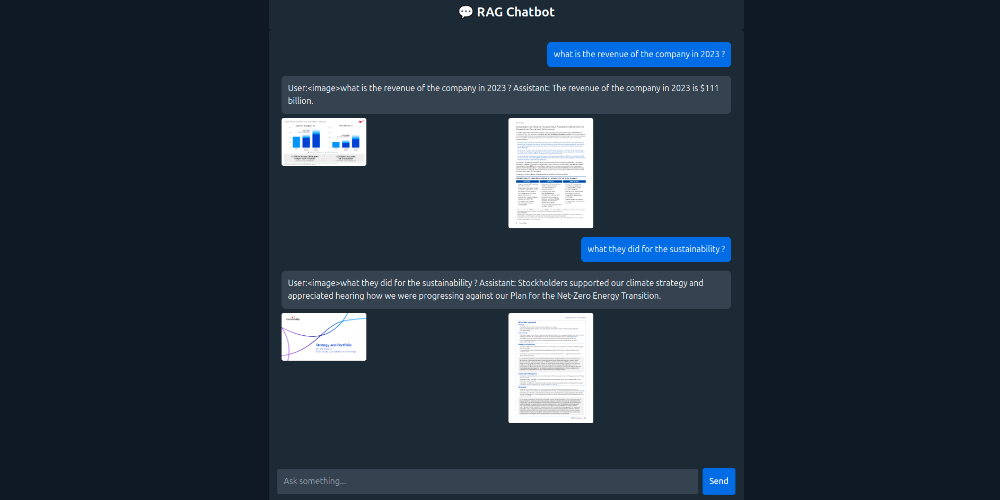
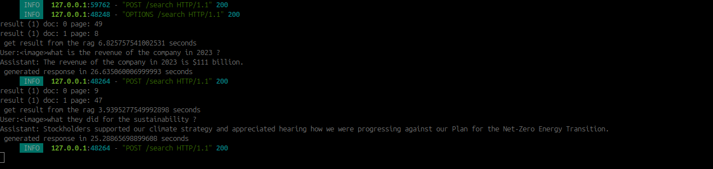

# PPTRag


# Installation 

### Install UV , pnpm and its dependencies
1. Install uv based on its recommended version: https://docs.astral.sh/uv/getting-started/installation/
2. Install node and pnpm
### Usage

```
pnpm install # install dependencies
pnpm run dev # running frontend UI
```

```
uv sync # install dependencies
uv run fastapi dev # running backend service
```


### V1
#### Frontend


#### Backend
