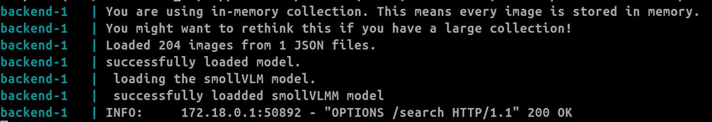

# PPTRag
A complete offline, local multi modal RAG system. 

# Installation 

### Using Docker compose

1. clone the repo. 
```
git clone https://github.com/shekharkoirala/PPTRag.git
cd PPTRag
```
2. Download the embeddings and put it inside the backend folder. 
```
https://drive.google.com/file/d/1eA1tGJQQJjKJmYToEapYhA918lNnSCb1/view?usp=sharing
```

```
📂 backend
├── 📂 .byaldi
│   ├── 📂 reports
│   │   ├── doc_ids_to_file_names.json.gz
│   │   ├── embed_id_to_doc_id.json.gz
│   │   ├── index_config.json.gz
│   │   ├── metadata.json.gz
├── 📂 app
│   ├── __pycache__
│   ├── generator.py
│   ├── main.py

Make sure the folder structure matches the structure when you unzip it
```
3. Run the docker compose
```
docker compose up --build
```
4. wait till server properly loads up. 

You will see the logs of smollVlm model being loaded. 

5. Browse the rag. 
```
http://localhost:80/
```
You might have to wait 10-15 minutes for the initial first messages. but usually it give answers in 1 minutes. 

or 

### Install UV , pnpm and its dependencies
1. Install uv based on its recommended version: https://docs.astral.sh/uv/getting-started/installation/
2. Install node and pnpm
### Usage

```
pnpm install # install dependencies
pnpm run dev # running frontend UI
```

```
uv sync # install dependencies
uv run fastapi dev # running backend service
```

### Data Ingestion
1. Either use the ingestion pipeline 
```
python ingestion/ingest.py --path ./data/pdf    
```
*reports collections will be made for byaldi using the colpali model. The process will take around 10/15 mins. 

2. Or Download the zip and put it in the backend folder as .byaldi folder

```
https://drive.google.com/file/d/1eA1tGJQQJjKJmYToEapYhA918lNnSCb1/view?usp=sharing
```


### V1
#### Frontend


#### Backend


### Notes

1. [Development Timeline](https://github.com/shekharkoirala/PPTRag/blob/main/changelog.md)
2. My first recommendation is to use [Milvus](https://milvus.io/) as vector storage ( best for production settings as well. ) Here [Byaldi](https://github.com/AnswerDotAI/byaldi) is used due to two main reason
a. It has clean rag pipeline.
b. It works with both CPU/GPU ( this is my main reason.)
3. Rag system contains Retriever and the generator
a. Retriever: byaldi is used as data are preprocessed and loaded in CPU as vectors. 
b. Generator: As the system is multi-modal, smolVlm model is used for the generation task. 